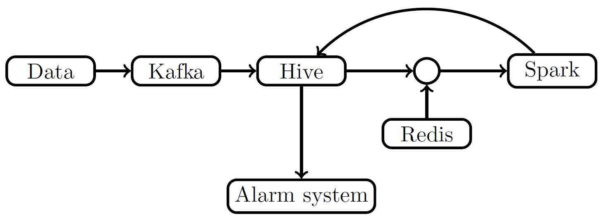

  </a>

## Big Data Pipeline

The pipeline is made from multiple pipe segments which can, but don't have to, connect to each other.  

### Research and analysis

Before solving a problem make sure you choose the right tools.  
Data has to be gathered, enriched, analysed and stored.  
Apache Kafka, Apache Spark, Apache Hive and Redis seem like the right tools for this job.  

You can see how I've come to this conclusion by visiting [GitHub folder](https://github.com/MislavJaksic/KnowledgeRepository/tree/master/BigData).  

### [Data Source to Kafka](https://github.com/MislavJaksic/Big-Data-Pipeline/tree/master/Data-Source-To-Kafka)

* a.k.a. Kafka Producer
* Transports data from a CSV file to Kafka
* Written in Python

### [Kafka To Hive](https://github.com/MislavJaksic/Big-Data-Pipeline/tree/master/Kafka-To-Hive/src/main/java/mjaksic/Kafka_To_Hive)

* a.k.a. Kafka Consumer
* Transports data from Kafka to Apache Hive
* Written in Java, packaged using Maven

### [Hive-Redis To Spark To Hive](https://github.com/MislavJaksic/Big-Data-Pipeline/tree/master/Hive-Redis-To-Spark-To-Hive/src/main/java/mjaksic/Hive_Redis_To_Spark_To_Hive) 

1) Takes data from both Apache Hive and Redis
2) Combines data into a single object
3) Sends objects into Apache Spark for analysis
4) Stores results back into Apache Hive

* Written in Java, packaged using Maven
